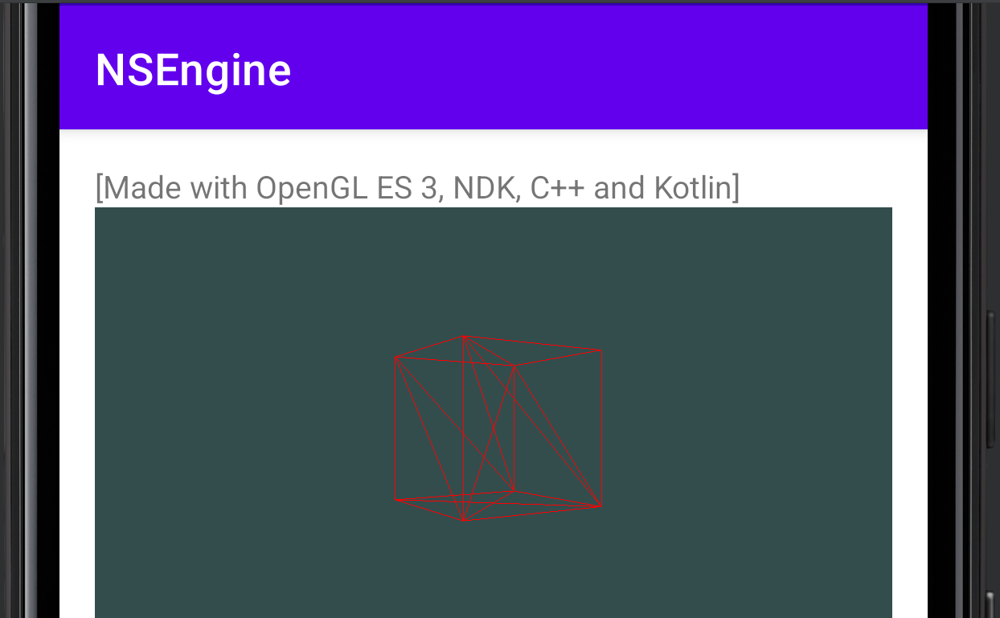

# NSEngine Android
---
Um exemplo de uso de OpenGL ES 3, C++, NDk e Kotlin.

## Desenvolvimento
Ainda em produção..

## Compilação & Execução
---
Testado apenas no Android Studio (Windows 10) e Smartphone com sistema operacional Android.

